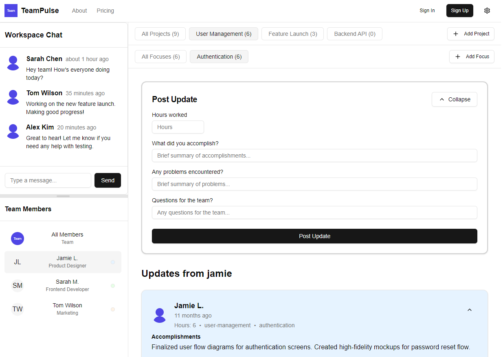

# TeamPulse Knowledge Worker Dashboard



TeamPulse is a comprehensive team productivity tracking application designed for knowledge workers. It provides a dynamic project and focus management system with daily updates tracking.

## Features

### 🚀 Dynamic Project Management
- User-created projects and focus areas
- Hierarchical structure: Project > Focus
- Easy project and focus navigation
- Instant selection of newly created items

### 📝 Update Creation System
- Four key input fields:
  - Hours worked
  - Accomplishments
  - Problems encountered
  - Questions for the team
- Collapsible, single-line input by default
- Expandable for detailed entries

### 📊 Feed Management
- Real-time updates display
- Advanced filtering by:
  - Project
  - Focus Area
  - Team Member
- Responsive card-based layout
- Empty state handling

### 💬 Comments System
- Per-update comment threads
- Collapsible comment section
- Real-time comment addition
- Author avatars and timestamps

## Tech Stack

- **Framework**: Next.js 14
- **Styling**: Tailwind CSS
- **UI Components**: 
  - Radix UI
  - Shadcn UI
- **Icons**: Lucide React
- **Type Safety**: TypeScript

## Getting Started

1. Install dependencies:
```bash
npm install
```

2. Run the development server:
```bash
npm run dev
```

3. Open [http://localhost:3000](http://localhost:3000) with your browser

## Project Structure

```
teampulse/
├── app/
│   └── page.tsx       # Main dashboard page
├── components/
│   ├── main-nav.tsx   # Project/Focus navigation
│   ├── feed.tsx       # Updates feed
│   ├── comments.tsx   # Comments system
│   └── update-creator.tsx # Update creation form
└── lib/
    └── utils.ts       # Utility functions
```

## Development Status

Currently in active development with the following features planned:
- Backend API integration
- Persistent storage
- User authentication
- Real-time updates
- Data export functionality

## Contributing

Feel free to submit issues and enhancement requests!

## License

MIT License - see LICENSE file for details
